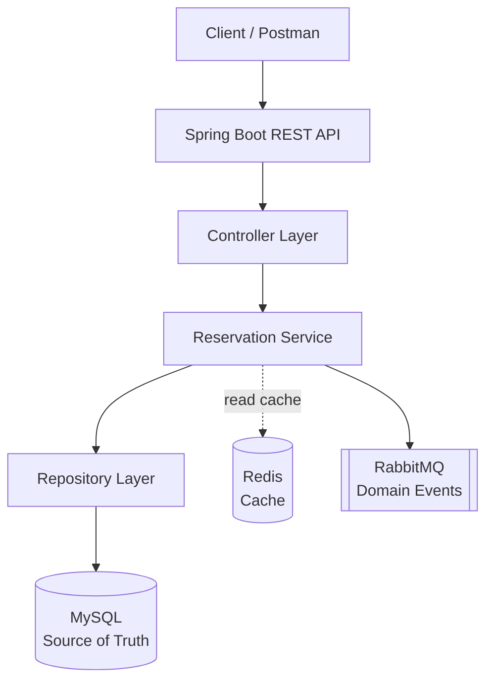
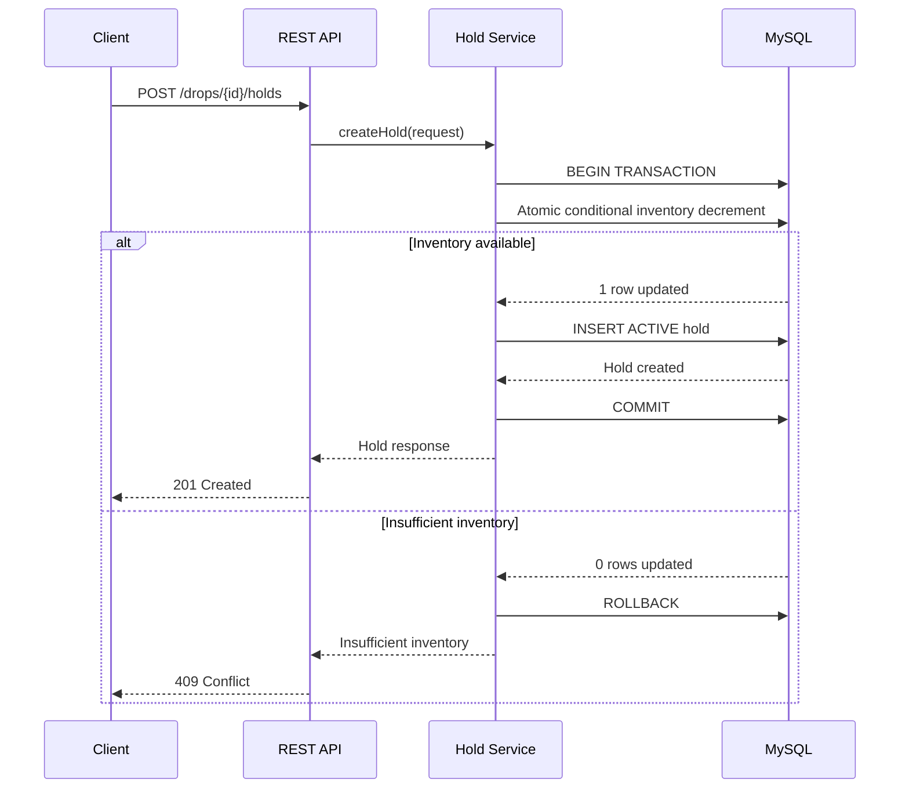
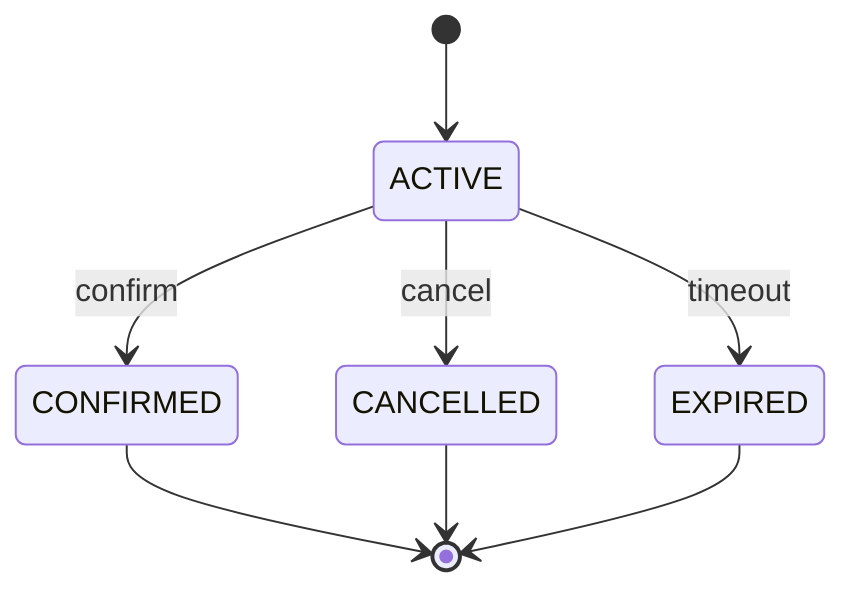
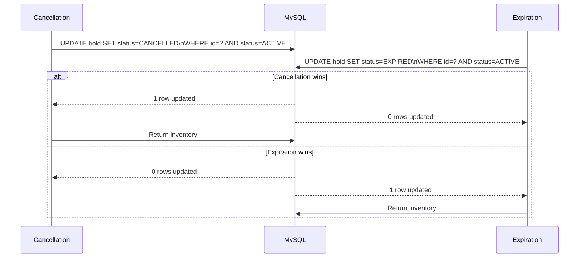

# High-Level Design: KIBO Limited Drop Reservation Service

## 1. Architecture Overview

```mermaid
flowchart TB
    Client["Client / Postman"]

    API["Spring Boot REST API"]

    Controller["Controller Layer"]
    Service["Reservation Service"]
    Repository["Repository Layer"]

    MySQL[("MySQL\nSource of Truth")]
    Redis[("Redis\nCache")]
    RabbitMQ[["RabbitMQ\nDomain Events"]]

    Client --> API
    API --> Controller
    Controller --> Service
    Service --> Repository
    Repository --> MySQL

    Service -. "read cache" .-> Redis
    Service --> RabbitMQ
```

## 2. Place Hold Flow

```mermaid
sequenceDiagram
    participant C as Client
    participant API as REST API
    participant S as Hold Service
    participant DB as MySQL

    C->>API: POST /drops/{id}/holds
    API->>S: createHold(request)

    S->>DB: BEGIN TRANSACTION

    S->>DB: Atomic conditional inventory decrement

    alt Inventory available
        DB-->>S: 1 row updated
        S->>DB: INSERT ACTIVE hold
        DB-->>S: Hold created
        S->>DB: COMMIT
        S-->>API: Hold response
        API-->>C: 201 Created
    else Insufficient inventory
        DB-->>S: 0 rows updated
        S->>DB: ROLLBACK
        S-->>API: Insufficient inventory
        API-->>C: 409 Conflict
    end
```

## 3. Hold State Machine

```mermaid
stateDiagram-v2
    [*] --> ACTIVE

    ACTIVE --> CONFIRMED: confirm
    ACTIVE --> CANCELLED: cancel
    ACTIVE --> EXPIRED: timeout

    CONFIRMED --> [*]
    CANCELLED --> [*]
    EXPIRED --> [*]
```

## 4. Cancellation vs. Expiration Race

```mermaid
sequenceDiagram
    participant A as Cancellation
    participant DB as MySQL
    participant B as Expiration

    A->>DB: UPDATE hold SET status=CANCELLED\nWHERE id=? AND status=ACTIVE
    B->>DB: UPDATE hold SET status=EXPIRED\nWHERE id=? AND status=ACTIVE

    alt Cancellation wins
        DB-->>A: 1 row updated
        DB-->>B: 0 rows updated
        A->>DB: Return inventory
    else Expiration wins
        DB-->>A: 0 rows updated
        DB-->>B: 1 row updated
        B->>DB: Return inventory
    end
```
